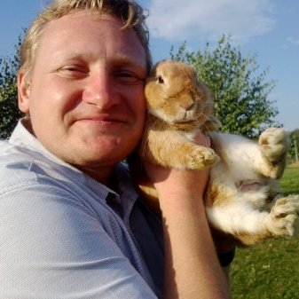

Freelance DevOps and software enthusiast.

Kazan, Tatarstan Republic, Russian Federation.

Installing and solving issues with [BSD](http://www.bsd.org) since 1995

Fighting  with different Linux distributions since 1997 (after OS/2 was dropped by IBM)

Ported sone software to QNX 6.3.2, NC Developer since 2008

Fan of [Plan 9](http://plan9.bell-labs.com) since it was opensourced.

Programming languages: shell, C, Limbo, Go-lang

[LinkedIn](https://www.linkedin.com/in/zhilkinsergey/)
[GitHub (useless bits)](https://github.com/szhilkin)
[Docker HUB](https://hub.docker.com/u/szhilkin/)

Links

[9P.io](http://9p.io)

[cat-v](http://cat-v.org)

[9front](http://9front.org)
